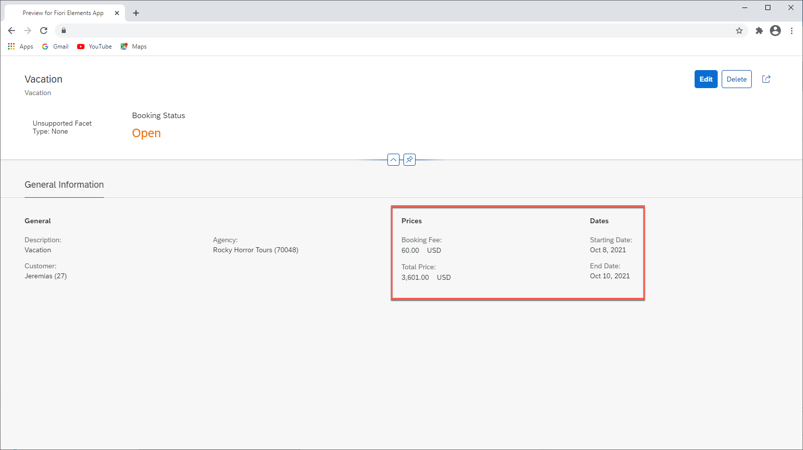
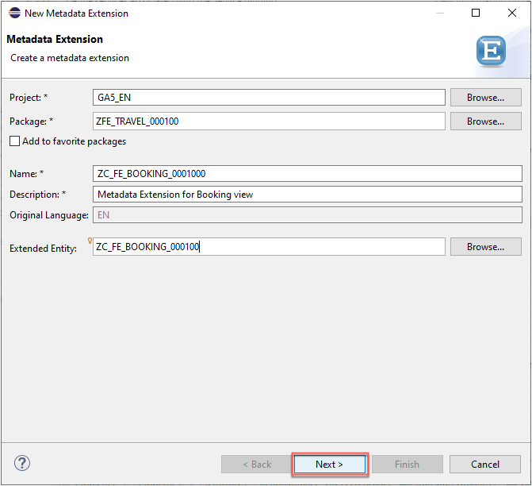
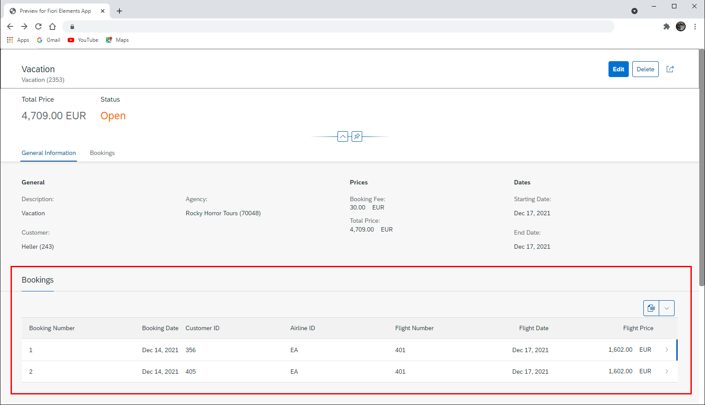
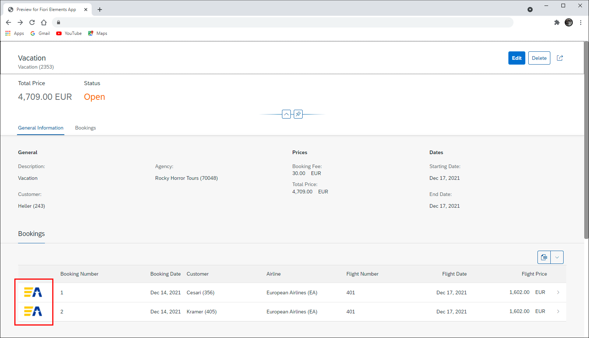

# Hands-on exercise for day 2 unit 1:<br/>Creating an object page

## Previous exercise
[Hands-On exercise for day 1 unit 6: Creating a list report](../day1/unit6.md)

## Video on openSAP.com platform
[Creating an object page](https://open.sap.com/courses/fiori-ea1/items/1qHcOcDQdJyNCHUcYbgCw6)

## Introduction
In this unit you will add annotations to refine an object page (the 'travel details'). You  will use the ABAP Development Tools in Eclipse which you installed in the [hands-on exercises for day 1 unit 4 ](../day1/unit4.md). 

You will learn how to
  - Add a title and a subtitle to the object page header
  - Add key data to the object page header
  - Add a section and use field groups to structure data
  - Add a table
  - Include pictures in a table

>Whenever your unique suffix for creating objects is needed, the object names within this tutorial are named with suffix "######". For the screenshots the suffix "000100" was used.

**Prerequisite: You have performed all previous exercises of this course.**

## Step 1. Add title and subtitle to the object page header
Clicking on any item of the list report will show the object page for this item. The object page currently shows only some standard buttons and does not contain any further fields or actions.
In this step you will add annotations to show a title and a subtitle in the object page header.

>Remember that you can use **code completion** by pressing **`CTRL+SPACE`** at the relevant positions in your coding

1. Open the metadata extensions for the Travel view `ZC_FE_TRAVEL_######`. In the previous unit you already defined header information. Now you will enhance the annotation `@UI.headerInfo` with a `title` and a `description` property.

    ```CDS
    ...

    @UI: {
        headerInfo: {
            typeName: 'Travel',
            typeNamePlural: 'Travels',
            title: {
                type: #STANDARD, value: 'Description'
            },
            description: {
                value: 'TravelID'
            }
        },
    ...

    ```

    Click **Save** and **Activate**.

2. Refresh the browser window. You will see an object page containing a title and a subtitle in the header and an empty content section.
   By the time the screenshot got created the subtitle falsely showed the text as subtitle. This was corrected in the meantime, and it shows the ID now.
  
   


## Step 2. Add data points to the object page header
In this step you will add some key information to the object page header using data points.

1. As in the steps before, open the metadata extensions for the Travel view `ZC_FE_TRAVEL_######`.

    Add the `@UI.facet` annotation with two objects of type `#DATAPOINT_REFERENCE`. 

    ```CDS
    ...
    annotate view ZC_FE_TRAVEL_###### with
    {

        @UI.facet: [
          {
              id: 'TravelHeaderPrice',
              purpose: #HEADER,
              type: #DATAPOINT_REFERENCE,
              position: 10,
              targetQualifier: 'PriceData'
          },
          {
              id: 'TravelHeaderOverallStatus',
              purpose: #HEADER,
              type: #DATAPOINT_REFERENCE,
              position: 20,
              targetQualifier: 'StatusData'
           }
      ]

      @UI.lineItem: [{ position: 10}]
      TravelID;  
      ...      
    ```

2. Annotating properties `TotalPrice` and `OverallStatus` with `@UI.datapoint` using the `targetQualifier` from the facet definition in step 1 will assign the properties to the header facet accordingly.

    ```CDS
    ...
    @UI.lineItem: [{ position: 70}]
    @UI.dataPoint: { qualifier: 'PriceData', title: 'Total Price'}
    TotalPrice;
    ...
    ```
    ```CDS
    ...
    @UI.lineItem: [{ position: 80, criticality: 'OverallStatusCriticality' }]
    @UI.selectionField: [{ position: 30}]
    @UI.textArrangement: #TEXT_ONLY
    @UI.dataPoint: { qualifier: 'StatusData', title: 'Status', criticality: 'OverallStatusCriticality' }
    OverallStatus;
    ...
    ```
    Click **Save** and **Activate**.


3. Switch to the app preview and refresh the browser window. The two new data points show up in the object page header. The labels are taken from property `title`, the color of **Status** from property `criticality` of the `datapoint` annotations .

    

## Step 3. Add a new section with title "General Information"
In this step you will add a section to the content area of the object page. The section will contain a form with three data fields.

1. Open the metadata extension file for the Travel view `ZC_FE_TRAVEL_######` and enter the facet annotations that define the section **General Information** as a collection facet, using the type `Collection`. Add a second facet as a child of **General Information** with facet type `#IDENTIFICATION_REFERENCE` to create a form with title **General**. Add the code from line 8 to line 21 to your existing UI facet definition.


    ```CDS
    ...
    annotate view ZC_FE_TRAVEL_###### with
    {

      @UI.facet: [
      ...

        {
          label: 'General Information',
          id: 'GeneralInfo',
          type: #COLLECTION,
          position: 10
        },
        {
          label: 'General',
          id: 'Travel',
          type: #IDENTIFICATION_REFERENCE,
          purpose: #STANDARD,
          parentId: 'GeneralInfo',
          position: 10
        }
      ]

    ...

    }
    ```

2. Add a new field `Description` and annotate this and the properties `AgencyID` and `CustomerID` with `@UI.Identification` to position these fields under **General**.

    ```CDS
    annotate view ZC_FE_TRAVEL_###### with
    {

    ...

      @UI.lineItem: [{ position: 10}]
      TravelID;

      @UI.identification: [{ position: 10 }]
      Description;

      @UI.lineItem: [{ position: 20}]
      @UI.selectionField: [{ position: 10}]
      @UI.identification: [{ position: 30 }]
      AgencyID;

      @UI.lineItem: [{ position: 30}]
      @UI.selectionField: [{ position: 20}]
      @UI.identification: [{ position: 20 }]
      CustomerID;
    ...
    }
    ```

    Click **Save** and **Activate**.


3. Refresh the app window. The new form **General** is shown in section **General Information** containing the three fields.

    

## Step 4. Add two additional field groups to section "General Information"
A field group contains one or more data fields inside a UI container. In this step you define two field groups in section **General Information**.

1. Open the metadata extension file for the Travel view `ZC_FE_TRAVEL_######`.

    First, define a field group for the beginning and end date of a travel item and for the prices. The facet type for a field group is `#FIELDGROUP_REFERENCE`. Add the code from line 8 to line 25 to the end of the `@UI.facet` section.

    ```CDS
    annotate view ZC_FE_TRAVEL_###### with
    {

      @UI.facet: [
        {

        ...
        {
          id: 'Dates',
          purpose: #STANDARD,
          type: #FIELDGROUP_REFERENCE,
          parentId: 'GeneralInfo',
          label: 'Dates',
          position: 30,
          targetQualifier: 'DatesGroup'
        },
        {
          id: 'Prices',
          purpose: #STANDARD,
          type: #FIELDGROUP_REFERENCE,
          parentId: 'GeneralInfo',
          label: 'Prices',
          position: 20,
          targetQualifier: 'PricesGroup'
        }
      ]
    ...

    }
    ```

2. Annotate the properties `BeginDate` and `EndDate `with `@UI.fieldGroup`. Make sure you use the same field group qualifier `DatesGroup` but different positions in each annotation. Apply the same for the properties `BookingFee` and `TotalPrice` using field group annotations with qualifier `PricesGroup`.

    ```CDS
     ...

     @UI.lineItem: [{ position: 40}]
     @UI.fieldGroup: [{ qualifier: 'DatesGroup', position: 10 }]
     BeginDate;

     @UI.lineItem: [{ position: 50}]
     @UI.fieldGroup: [{ qualifier: 'DatesGroup', position: 20 }]
     EndDate;

     @UI.lineItem: [{ position: 60}]
     @UI.fieldGroup: [ { qualifier: 'PricesGroup', position: 10} ]
     BookingFee;

     @UI.lineItem: [{ position: 70}]  
     @UI.dataPoint: { qualifier: 'PriceData', title: 'Total Price'}
     @UI.fieldGroup: [{ qualifier: 'PricesGroup', position: 20 }]
     TotalPrice;

     ...
    ```

    Click **Save** and **Activate**.

3. Refresh the app window. There are two additional field groups showing price and date information.

    


## Step 5. Show the Bookings Table in a new section
In this step you will add a new section that contains a table with booking information. This requires access to another entity `Booking` via an association and an additional metadata extension file.

1. Open the metadata extension file for the Travel view `ZC_FE_TRAVEL_######`. In the facet annotation block add a new facet **Booking** with type `#LINEITEM_REFERENCE`. Add the code from line 7 to line 14 to the end of the `@UI.facet` section. Click **Save** and **Activate**.

    ```CDS
    ...
    annotate view ZC_FE_TRAVEL_###### with
    {
      ...
      @UI.facet: [
        ...
        {
          id: 'Booking',
          purpose: #STANDARD,
          type: #LINEITEM_REFERENCE,
          label: 'Bookings',
          position: 20,
          targetElement: '_Booking'
        }
      ]
    ...

    ```
    Note the property `targetElement: _Booking` which references the association to the booking table that will be shown in the facet **Booking**. You can lookup the definition of `_Booking` in `ZC_FE_TRAVEL_###### Projection View of Travel` in the **Data Definitions** folder.

2. In the `Project Explorer` open the `Data Definitions` section, right-click on `ZC_FE_BOOKING_###### Projection View for Booking` and create a new metadata extension file from the context menu. Enter `ZC_FE_BOOKING_######` in field **Name** and `Metadata Extension for Booking view` in field **Description**.

    

    Click Buttons **Next** and **Finish**.

3. In the metadata extension file `ZC_FE_BOOKING_######` use `@UI.lineItem` annotations to add some fields from the Booking view `ZC_FE_BOOKING_###### Projection View for Booking` view to the bookings table. Replace the content of `ZC_FE_BOOKING_######` by the following code.

    ```CDS
    @Metadata.layer: #CORE

    annotate view ZC_FE_BOOKING_######
      with
    {
        @UI.lineItem: [ { position: 10 } ]
        BookingID;

        @UI.lineItem: [ { position: 20 } ]
        BookingDate;

        @UI.lineItem: [ { position: 30 } ]
        CustomerID;

        @UI.lineItem: [ { position: 40 } ]
        CarrierID;

        @UI.lineItem: [ { position: 50 } ]
        ConnectionID;

        @UI.lineItem: [ { position: 60 } ]
        FlightDate;

        @UI.lineItem: [ { position: 70 } ]
        FlightPrice;

    }
    ```
    Click **Save** and **Activate**.

4. Change to the app preview and refresh the browser window. The booking table is now displayed in the new **Bookings** section of the object page.

    


5. Instead of showing IDs for the fields Customer ID and Airline ID one would preferably show descriptions or names.

    This will be made possible by using specific annotations which are  implemented within the projection view `ZC_FE_BOOKING_######`. Therefore open the projection view located in folder `Data Definitions` which contains the root view definitions for the booking entity.

    Add the `@ObjectModel` and `@EndUserText` annotations to the fields as shown in the coding fragments below.

    Annotation `@EndUserText.label` defines the column label for the related fields. Using annotation `@ObjectModel.text.element` controls the source of the content shown for the related field. Fields `CarrierID` and `CustomerID` will get their content by accessing the related field through the corresponding association.

    ```CDS
    @EndUserText.label: 'Customer'
    @ObjectModel.text.element: ['LastName']
    CustomerID,
    _Customer.LastName as LastName,
    ```

    ```CDS
    @EndUserText.label: 'Airline'
    @ObjectModel.text.element: ['CarrierName']
    CarrierID,
    _Carrier.Name as CarrierName,
    ```
   Click **Save** and **Activate**.


6. Change to the app preview and refresh the browser window. The booking table is now displayed in the new **Bookings** section of the object page with descriptions for **Customer** and **Airline**.

    

## Step 6. Airline pictures in Bookings table
In this step you will add a picture with the airline logo in a new column at the beginning of the booking table.

1. To achieve this, open the metadata extension file `ZC_FE_BOOKING_######` and add the following code lines to the end of the annotation structure. The property `position` creates a new first column

    ```CDS

        @UI.lineItem: [ { position: 05, label: ' ', value: '_Carrier.AirlinePicURL' } ]
        _Carrier;

        }
    ```

    Click **Save** and **Activate**.

2. Change to the app preview and refresh the browser window. The booking table is now displayed with the airline pictures in the first column.

    

## Summary
You have completed the exercise!
In this unit, you have learned how to create an object page using ABAP CDS annotation.

## Next Exercise
[Day 2 Unit 3: Preparing your front-end development environment](unit3.md)
